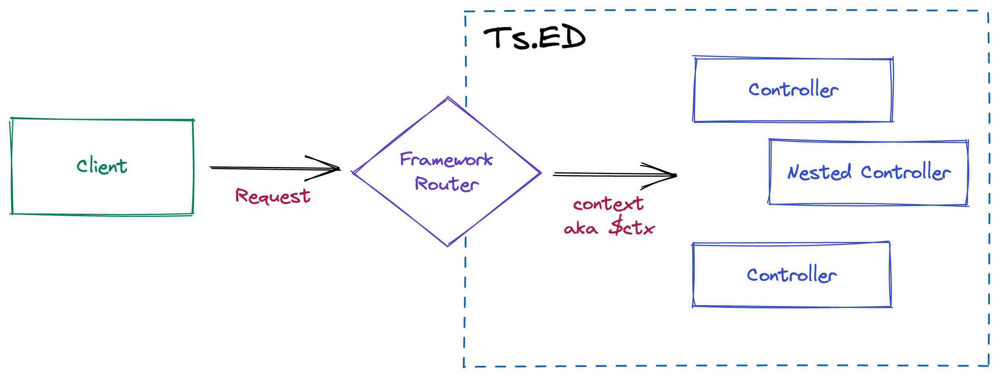

# Create your first controller

Controllers are responsible for handling incoming **requests** and returning **responses** to the client.



For this step, we'll create a new `CalendarController.ts` in our project. We can do that using Ts.ED cli:

```sh
# npm -g @tsed/cli
tsed g controller Calendars
```

```ansi
? Which route? /calendars
? Which directory? rest
✔ Generate controller file to 'controllers/rest/CalendarsController.ts'
↓ Update bin/index
```

The content generated file should be something like that:

```ts {4,6}
import {Controller} from "@tsed/di";
import {Get} from "@tsed/schema";

@Controller("/calendars")
export class CalendarsController {
  @Get("/")
  get() {
    return "hello";
  }
}
```

All controllers decorated with [Controller](/ai/api/di/types/common/decorators/decorator-controller.md) create a new Platform router under the hood (Platform Router is an abstraction layer to generate the routes for the targeted platform like Express.js or Koa.js)

A Platform router requires a path (here, the path is `/calendars`) to expose an url on our server.

::: info
More precisely, it's a chunk of a path, and the entire exposed url depends on the Server configuration (see [Configuration](/docs/configuration/index))
and the [children controllers](/docs/controllers).
:::

In this case, we have no nested controller and the root endpoint is set to `/rest` in our `Server.ts`.

```ts {6,12,13,14}
import {Configuration} from "@tsed/di";
import "@tsed/platform-express"; // /!\ keep this import
import "@tsed/ajv";
import "@tsed/swagger";
import {config} from "./config/index";
import * as rest from "./controllers/rest/index"; // [!code focus]
import * as pages from "./controllers/pages/index";

@Configuration({
  ...config,
  mount: {
    "/rest": [
      // [!code focus]
      ...Object.values(rest) // [!code focus]
    ], // [!code focus]
    "/": [...Object.values(pages)]
  }
})
export class Server {}
```

So the controller's url will be `http://localhost:8083/rest/calendars`.

The last step is to regenerate the barrels files using the following command:

::: code-group

```sh [npm]
npm run barrels (test)
```

```sh [yarn]
yarn run barrels
```

```sh [pnpm]
pnpm run barrels
```

```sh [bun]
bun run barrels
```

:::

Now we can start our server and test our new exposed endpoint:

::: code-group

```sh [npm]
npm run start
```

```sh [yarn]
yarn run start
```

```sh [pnpm]
pnpm run start
```

```sh [bun]
bun run start
```

:::

The terminal should display our new endpoint:

```ansi
[2024-02-21T07:42:50.029] [INFO ] [TSED] - Loading EXPRESS platform adapter... +2ms
[2024-02-21T07:42:50.030] [INFO ] [TSED] - Injector created... +1ms
[2024-02-21T07:42:50.066] [INFO ] [TSED] - Build providers +35ms
[2024-02-21T07:42:50.107] [INFO ] [TSED] - Settings and injector loaded... +41ms
[2024-02-21T07:42:50.107] [INFO ] [TSED] - Mount app context +0ms
[2024-02-21T07:42:50.107] [INFO ] [TSED] - Load routes +0ms
[2024-02-21T07:42:50.111] [INFO ] [TSED] - Routes mounted... +4ms
[2024-02-21T07:42:50.111] [INFO ] [TSED] - 
┌───────────────┬───────────────────┬────────────────────────────┐
│ Method        │ Endpoint          │ Class method               │
│───────────────│───────────────────│────────────────────────────│
│ GET           │ /rest/calendars   │ CalendarsController.get()  │  // [!code highlight]
│───────────────│───────────────────│────────────────────────────│
│ GET           │ /                 │ IndexController.get()      │
└───────────────┴───────────────────┴────────────────────────────┘
[2024-02-21T07:42:50.114] [INFO ] [TSED] - Listen server on http://0.0.0.0:8083
[2024-02-21T07:42:50.114] [INFO ] [TSED] - [default] Swagger JSON is available on http://0.0.0.0:8083/doc/swagger.json
[2024-02-21T07:42:50.114] [INFO ] [TSED] - [default] Swagger UI is available on http://0.0.0.0:8083/doc/
[2024-02-21T07:42:50.114] [INFO ] [TSED] - Started in 87 ms +3ms
```

::: tip
Ts.ED will always display the exposed endpoints in the terminal. It's a good way to check if everything is working as expected.
You can disable this feature by setting the `logger.disableRoutesSummary` configuration to `false`.
:::

We can now test our new endpoint using a tool like [Postman](https://www.postman.com/), or using a simple curl:

```sh
curl --location 'http://localhost:8083/rest/calendars'

# Output
hello%
```

## Create a model

Before we continue, let's create a simple [model](/docs/model.md) to use in our controller.

Run the following command to create a new `Calendar` model:

```sh
# npm -g @tsed/cli
tsed g model Calendar
```

It will generate a new file in the `models` directory:

```ts
import {Property} from "@tsed/schema";

export class CalendarModel {
  @Property()
  id: string;
}
```

::: tip
Model feature provided by Ts.ED is a simple way to define a data structure.
It's based on the `@tsed/schema` package and can be used to validate incoming data, serialize outgoing data, and generate OpenAPI documentation.
:::

Let's add some properties to our `CalendarModel`. For our example, we'll add a `name` and a `description`:

::: code-group

```ts
import {Groups, MaxLength, MinLength, Property, Required} from "@tsed/schema";

export class CalendarModel {
  @Property()
  @Groups("!creation")
  @Required()
  id: string;

  @Required()
  @MinLength(3)
  name: string;

  @Required()
  @MaxLength(100)
  description: string;
}
```

```ts
import {getJsonSchema} from "@tsed/schema";
import Ajv from "ajv";

import {CalendarModel} from "./CalendarModel";

function validate(model: CalendarModel) {
  const schema = getJsonSchema(CalendarModel);

  const ajv = new Ajv();

  const isValid = ajv.validate(schema, model);

  return {
    isValid,
    errors: ajv.errors
  };
}

describe("CalendarModel", () => {
  it("should generate a JsonSchema", () => {
    const jsonSchema = getJsonSchema(CalendarModel);

    expect(jsonSchema).toEqual({
      type: "object",
      properties: {
        id: {
          minLength: 1,
          type: "string"
        },
        name: {
          type: "string",
          minLength: 3
        },
        description: {
          type: "string",
          minLength: 1,
          maxLength: 100
        }
      },
      required: ["id", "name", "description"]
    });
  });
  it("should generate a JsonSchema (creation)", () => {
    const jsonSchema = getJsonSchema(CalendarModel, {groups: ["creation"]});

    expect(jsonSchema).toEqual({
      type: "object",
      properties: {
        name: {
          type: "string",
          minLength: 3
        },
        description: {
          type: "string",
          minLength: 1,
          maxLength: 100
        }
      },
      required: ["name", "description"]
    });
  });

  it("should validate model", () => {
    const model = new CalendarModel();
    model.id = "1";
    model.name = "My calendar";
    model.description = "My calendar description";

    const {isValid} = validate(model);

    expect(isValid).toEqual(true);
  });

  it("should not validate the model if description is missing", () => {
    const model = new CalendarModel();
    model.id = "1";
    model.name = "My calendar";
    model.description = "";

    const {isValid, errors} = validate(model);

    expect(isValid).toEqual(false);
    expect(errors).toEqual([
      {
        instancePath: "/description",
        keyword: "minLength",
        message: "must NOT have fewer than 1 characters",
        params: {
          limit: 1
        },
        schemaPath: "#/properties/description/minLength"
      }
    ]);
  });
});
```

:::

Our `CalendarModel` now has three properties: `id`, `name`, and `description`. We also added some validation rules to our properties like:

-   `@Required()` to make sure the property is present in the payload,
-   `@MinLength(3)` to make sure the `name` property has at least 3 characters,
-   `@MaxLength(100)` to make sure the `description` property has at most 100 characters.
-   `@Groups("!creation")` to exclude the `id` property from the serialization when the `creation` group is used.

::: tip
This model will produce a JSON schema that can be tested using the [Swagger UI](/tutorials/swagger.md) or
in a unit test using the `@tsed/schema` package. See the `CalendarModel.spec.ts` tab for an example.
:::

We can now use our `CalendarModel` in our `CalendarsController`:

```ts
import {Controller} from "@tsed/di";
import {Get} from "@tsed/schema";
import {CalendarModel} from "../models/CalendarModel";

@Controller("/calendars")
export class CalendarsController {
  @Get("/")
  getAll() {
    const model = new CalendarModel();
    model.id = "1";
    model.name = "My calendar";
    model.description = "My calendar description";

    return [model];
  }
}
```

Now, if we run our server and test our endpoint, we should see the following output:

```sh
curl --location 'http://localhost:8083/rest/calendars'

# Output
[{"id":"1","name":"My calendar","description":"My calendar description"}]%
```

## Create a CRUD

Now that we have a basic understanding of how to create a controller, let's create a CRUD (Create, Read, Update, Delete) for our `Calendar` model.

We'll start by adding a `Post` method to create a new `Calendar`:

```ts
import {Controller} from "@tsed/di";
import {BodyParams} from "@tsed/platform-params";
import {Get, Groups, Post, Returns} from "@tsed/schema";
import {v4} from "uuid";

import {CalendarModel} from "../../models/CalendarModel";

@Controller("/calendars")
export class CalendarsController {
  private calendars: CalendarModel[] = [];

  @Get("/")
  getAll() {
    return this.calendars;
  }

  @Post("/")
  @Returns(201, CalendarModel)
  create(@BodyParams() @Groups("creation") calendar: CalendarModel) {
    calendar.id = v4();

    this.calendars.push(calendar);

    return calendar;
  }
}
```

As we can see on our `CalendarsController`, we added a new method `create` decorated with `@Post("/")`.
This method will be called when a `POST` request is sent to the `/rest/calendars` endpoint.

We also added a `@BodyParams` decorator to the `create` method. This decorator is used to inject the request body into the method.
`Groups` is used to specify which group should be used to validate the incoming payload.
Here we need to exclude the `id` property from the validation. This is why we use `@Groups("creation")`.

```sh
curl --location 'http://localhost:8083/rest/calendars' \
--header 'Content-Type: application/json' \
--data '{
    "name": "My calendar",
    "description": "My calendar description"
}'

# Output
{"id":"50de4b10-792e-44d5-9f61-56b3898ebf34","name":"My calendar","description":"My calendar description"}%

curl --location 'http://localhost:8083/rest/calendars'

# Output
[{"id":"50de4b10-792e-44d5-9f61-56b3898ebf34","name":"My calendar","description":"My calendar description"}]%
```

To complete our CRUD, we need to add a `Get` method to retrieve a `Calendar` by its `id`,
a `Put` method to update a `Calendar` by its `id`, and a `Delete` method to remove a `Calendar` by its `id`.

Here is the complete `CalendarsController`:

::: code-group

```ts [CalendarsController.ts]
import {Controller} from "@tsed/di";
import {NotFound} from "@tsed/exceptions";
import {BodyParams, PathParams} from "@tsed/platform-params";
import {Delete, Get, Groups, Post, Put, Returns} from "@tsed/schema";
import {v4} from "uuid";

import {CalendarModel} from "../../models/CalendarModel";

@Controller("/calendars")
export class CalendarsController {
  private calendars: CalendarModel[] = [];

  @Get("/")
  getAll() {
    return this.calendars;
  }

  @Get("/:id")
  @Returns(200, CalendarModel)
  @(Returns(404).Description("Calendar not found"))
  getById(@PathParams("id") id: string) {
    const calendar = this.calendars.find((calendar) => calendar.id === id);

    if (!calendar) {
      throw new NotFound("Calendar not found");
    }

    return calendar;
  }

  @Post("/")
  @Returns(201, CalendarModel)
  create(@BodyParams() @Groups("creation") calendar: CalendarModel) {
    calendar.id = v4();

    this.calendars.push(calendar);

    return calendar;
  }

  @Put("/:id")
  @Returns(200, CalendarModel)
  @(Returns(404).Description("Calendar not found"))
  update(@PathParams("id") id: string, @BodyParams() @Groups("update") calendar: CalendarModel) {
    const index = this.calendars.findIndex((calendar) => calendar.id === id);

    if (index === -1) {
      throw new NotFound("Calendar not found");
    }

    calendar.id = id;
    this.calendars[index] = calendar;

    return calendar;
  }

  @Delete("/:id")
  @Returns(204)
  @(Returns(404).Description("Calendar not found"))
  remove(@PathParams("id") id: string) {
    const index = this.calendars.findIndex((calendar) => calendar.id === id);

    if (index === -1) {
      throw new NotFound("Calendar not found");
    }

    this.calendars.splice(index, 1);
  }
}
```

```ts [CalendarsController.spec.ts]
import {PlatformTest} from "@tsed/common";
import {deserialize} from "@tsed/json-mapper";

import {CalendarModel} from "../../models/CalendarModel";
import {CalendarsController} from "./CalendarsController";

async function getControllerFixture() {
  const controller = await PlatformTest.invoke<CalendarsController>(CalendarsController);
  const calendar = deserialize<CalendarModel>({name: "name", description: "description"}, {type: CalendarModel, groups: ["creation"]});

  controller.create(calendar);

  return {
    calendar,
    controller
  };
}

describe("CalendarsController", () => {
  beforeEach(() => PlatformTest.create());
  afterEach(() => PlatformTest.reset());

  describe("getAll()", () => {
    it("should return all calendars", async () => {
      const {controller, calendar} = await getControllerFixture();

      expect(controller.getAll()).toEqual([calendar]);
    });
  });

  describe("getById()", () => {
    it("should return a calendar", async () => {
      const {controller, calendar} = await getControllerFixture();
      const result = controller.getById(calendar.id);

      expect(result).toEqual(calendar);
    });

    it("should throw an error if the calendar isn't found", async () => {
      const {controller, calendar} = await getControllerFixture();

      expect(() => controller.getById("not-found")).toThrow("Calendar not found");
    });
  });

  describe("create()", () => {
    it("should create a calendar", async () => {
      const {controller} = await getControllerFixture();

      const calendar = deserialize(
        {name: "name", description: "description"},
        {
          type: CalendarModel,
          groups: ["creation"]
        }
      );

      expect(calendar.id).toBeUndefined();

      const created = controller.create(calendar);

      expect(created.id).toEqual(expect.any(String));
      expect(controller.getAll()).toHaveLength(2);
    });
  });

  describe("update()", () => {
    it("should update a calendar", async () => {
      const {controller, calendar} = await getControllerFixture();
      const updateCalendar = deserialize<CalendarModel>(
        {name: "new name", description: "new description"},
        {type: CalendarModel, groups: ["update"]}
      );

      const updated = controller.update(calendar.id, updateCalendar);

      expect(updated.name).toEqual(updateCalendar.name);
      expect(updated.description).toEqual(updateCalendar.description);

      expect(controller.getAll()).toHaveLength(1);
    });

    it("should throw an error if the calendar isn't found", async () => {
      const {controller} = await getControllerFixture();
      const updateCalendar = deserialize<CalendarModel>(
        {name: "new name", description: "new description"},
        {type: CalendarModel, groups: ["update"]}
      );

      expect(() => controller.update("not-found", updateCalendar)).toThrow("Calendar not found");
    });
  });

  describe("remove()", () => {
    it("should remove a calendar", async () => {
      const {controller, calendar} = await getControllerFixture();

      controller.remove(calendar.id);

      expect(controller.getAll()).toHaveLength(0);
    });

    it("should throw an error if the calendar isn't found", async () => {
      const {controller} = await getControllerFixture();

      expect(() => controller.remove("not-found")).toThrow("Calendar not found");
    });
  });
});
```

:::

Our CRUD is ready to use. But the logic is entirely implemented in our controller. Ts.ED provide a way to separate the business logic from the controller logic using [Services](/docs/providers.md).
So, the next step is to use DI to create and inject a service in our controller.
